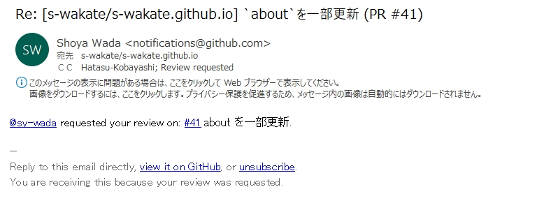
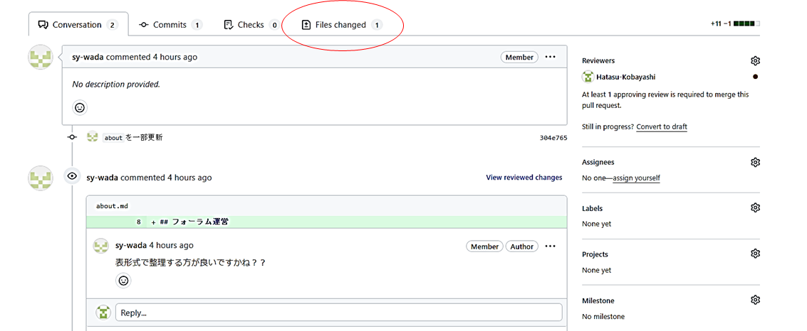
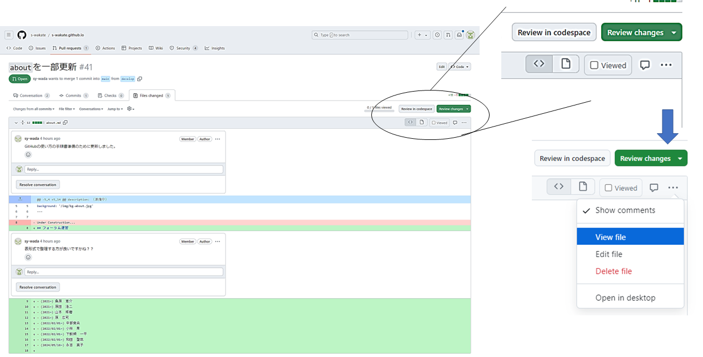
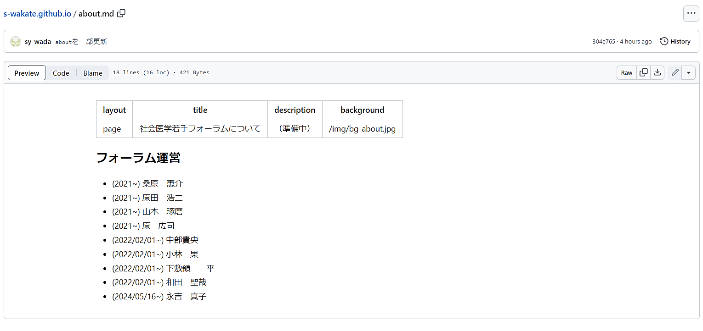
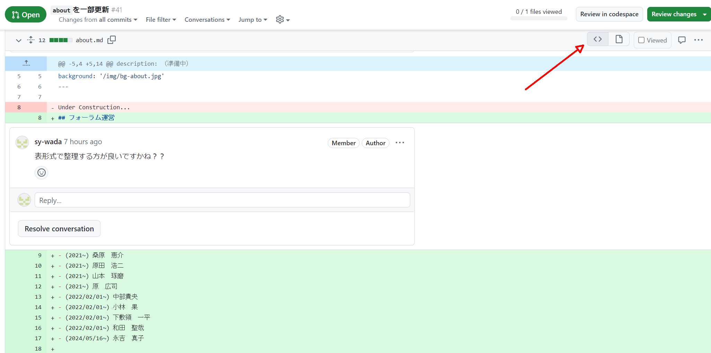
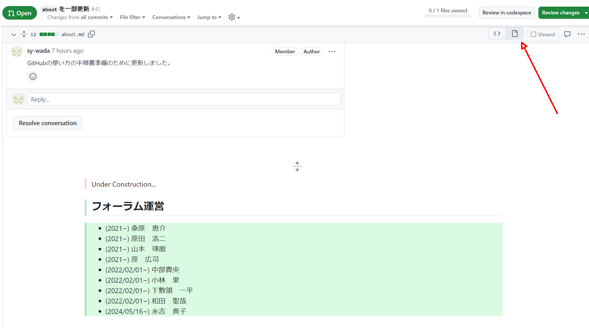
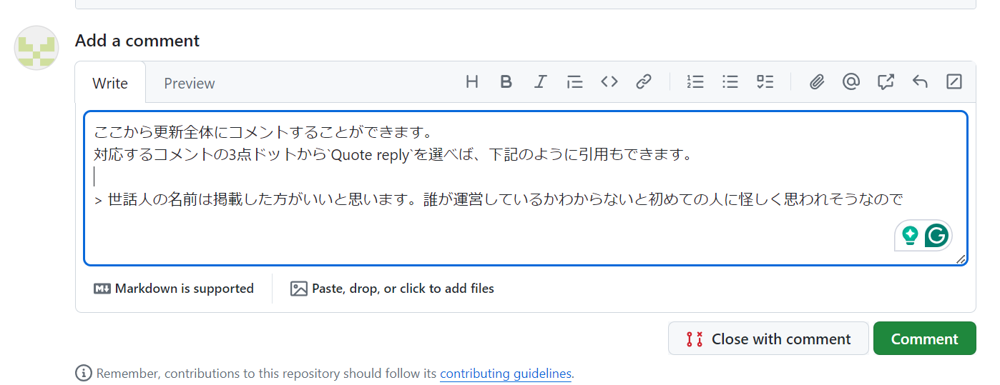
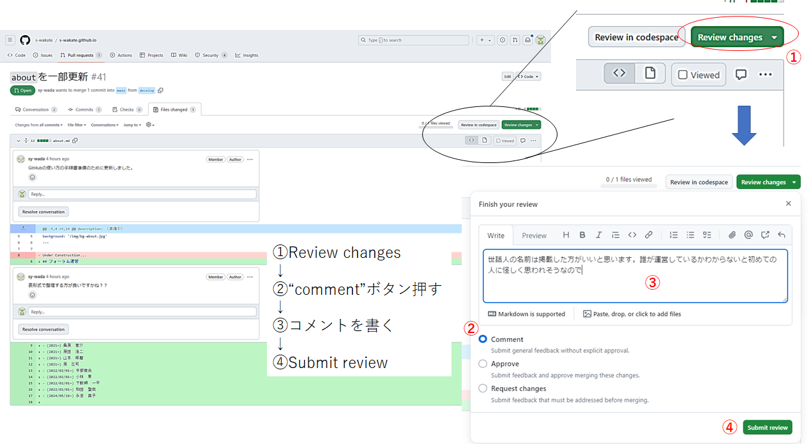
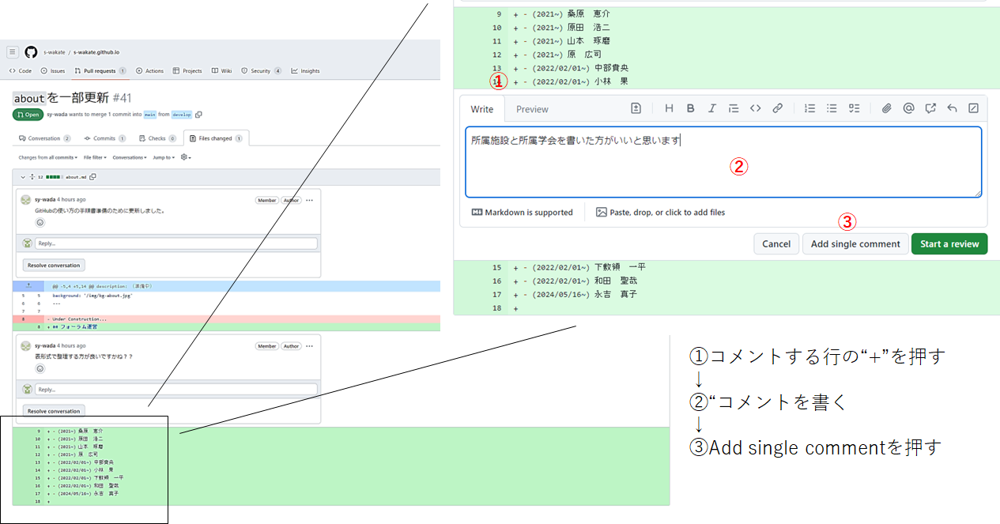
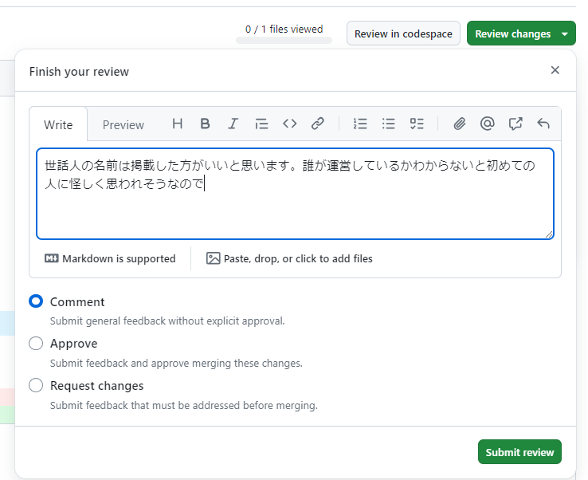

# Githubでの社会医学若手フォーラムHPレビュー手順

# 準備

1. [`https://github.com`](https://github.com) にアクセスして「サインアップ」からアカウントを作成する。
2. アカウントに登録したメールアドレスを和田先生に連絡する。
3. 和田先生がフォーラムHPのメンバーに登録すると、レビュー可能になる。

# 作業手順
レビューは3ステップです。  
コメントのついている問題が解決し、更新内容に問題がなければ**承認**を提出します。  

1. 変更箇所を表示
2. [ページプレビューを確認](#ページのプレビュー)（[`”View File”`](#view-file)あるいは[`”Display the rich diff”`](#dispaly-the-rich-diff)）
3. [コメントをつける](#コメントをつける)（[更新全体にコメント](#更新全体にコメント)、[ファイル単位でコメント](#ファイル単位でコメント)、[行単位でコメント](#行単位でコメント)のどれか）

↓↓  
[更新の承認](#更新の承認)  

## レビュー依頼メール
下記のようなメールが届いたら`”#〇”`をクリックする。  

## GitHubの画面構成
`Conversationタブ`は変更相談の一連のコメントを確認することができます。  
`“Files changed”`をクリックすると、ファイル毎に修正箇所の詳細を確認できます。  

## ページのプレビュー
ホームページ上でどのように表示されるかを確認するためには、[`View file`](#view-file) もしくは、[`Display the rich diff`](#dispaly-the-rich-diff)をご利用ください。  
※正確なレイアウトではありませんが、公開内容としての検討や誤字脱字などをチェックしていただけますと幸いです。

### View file
対象ファイルで3点ドットアイコン`…`から`“View file”`を選択してください。  

確認したら前のページに戻る  

### Dispaly the rich diff
こちらの方が視認しやすいかもしれません。  
使いやすい方をご利用ください。  

（標準モード：行単位のコメント可）

（リッチモード：行単位のコメントはできないが、ファイル単位でコメント可）

## コメントをつける
### 更新全体にコメント
#### Conversationタブから
`Conversationタブ`タブの下からコメントを投稿することができます。  

#### Review changesから
`Files changedタブ`をクリックして右側に表示される`Review changes`ボタンからコメントを投稿することができます。  

### ファイル単位でコメント
`Files changedタブ`から、各ファイルの右側にある会話アイコン（3点ドットアイコンの左側）をクリックするとコメントすることができます。  

### 行単位でコメント
`Files changedタブ`から、各行の`+`をクリックするとコメントすることができます。  

## 更新の承認
レビュー依頼をされた更新を承認する場合は、`Review changes`ボタンから`Approve`を選択し、`Submit review`ボタンを押してください。

